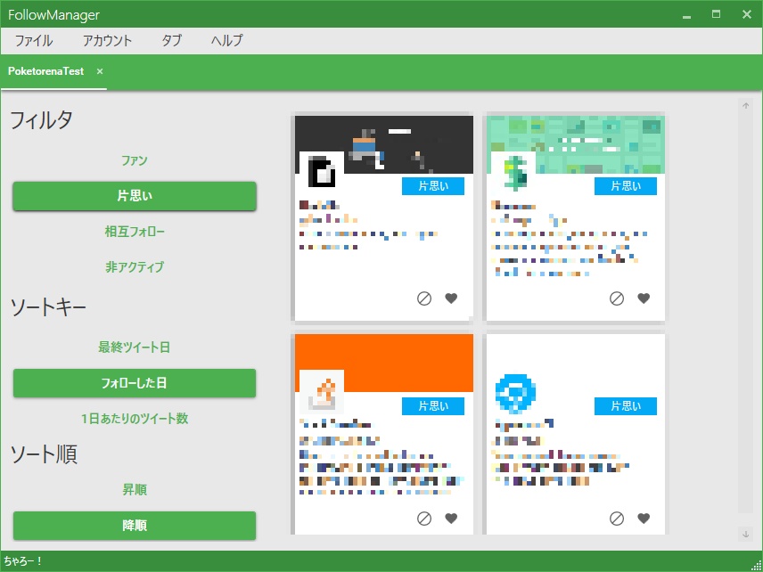

# FollowManager

## Description

Windowsで動作する、Twitterのフォロー整理を楽にするアプリです。

## Usage

### FollowManagerへTwitterアカウントを追加する

1. メニューバーの [アカウント] - [アカウントを追加] をクリックする。
1. Consumer Key、Consumer Secretを入力して [次へ] をクリックする。
1. ブラウザでTwitterにログインしてPincodeをコピーする。
1. コピーしたPincodeを入力して [次へ] をクリックする。

### FollowManagerからTwitterアカウントを削除する

1. メニューバーの [アカウント] - [アカウントを管理] をクリックする。
1. 削除したいアカウントの上で右クリックし、 [削除] をクリックする。

### アカウントタブを追加する

1. メニューバーの [タブ] - [新規タブ] をクリックする。
1. タブに追加したいアカウントをクリックする。

### アカウントタブを削除する

マウスでタブのバツボタンをクリックする。Ctrl + W でも閉じることができる。

### 表示するアカウントをフィルタする

以下のボタンをクリックして切り替える。

### 表示するアカウントをソートする際のキーを指定する

以下のボタンをクリックして切り替える。

### 表示するアカウントをソートする際の昇順、降順を指定する

以下のボタンをクリックして切り替える。

### 規定のブラウザでプロフィール画面を開く

以下の領域をクリックする。

### ブロックしてブロック解除する

以下のボタンをクリックして切り替える。

### お気に入り機能（起動時のみ）

以下のボタンをクリックして切り替える。

### ライセンス情報を見る

メニューバーの [ヘルプ] - [FollowManagerについて] をクリックする。

## Development Environment

* Windows 10 Home
* Visual Studio 2017 Enterprise

## Dependency

* .NET Framework 4.7.2
* Windows Presentation Foundation
* [Prism](https://github.com/PrismLibrary/Prism)
* [Unity](https://github.com/unitycontainer/unity)
* [CoreTweet](https://github.com/CoreTweet/CoreTweet)
* [Dragablz](https://github.com/ButchersBoy/Dragablz)
* [MahApps.Metro](https://github.com/MahApps/MahApps.Metro)
* [Material Design In XAML Toolkit](https://github.com/MaterialDesignInXAML/MaterialDesignInXamlToolkit)
* [MessagePack for C#](https://github.com/neuecc/MessagePack-CSharp)
* [Reactive Extensions](https://github.com/dotnet/reactive)
* [ReactiveProperty](https://github.com/runceel/ReactiveProperty)
* [virtualwrappanel](https://archive.codeplex.com/?p=virtualwrappanel)

## Author

[@science507](https://twitter.com/science507)
